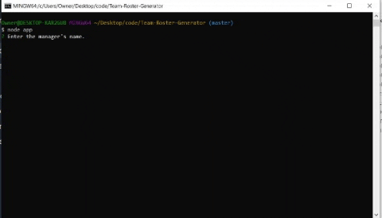

# Team-Roster-Generator

# Description
This node.js app allows the manager of a technical team to input all the members of his or her team and keep track of their information and roles. It outputs a simple html file so it can be accessed any time. 

